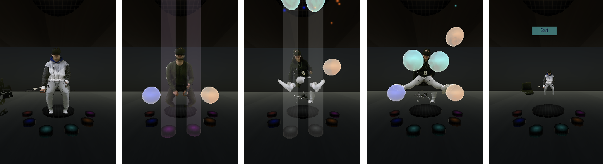
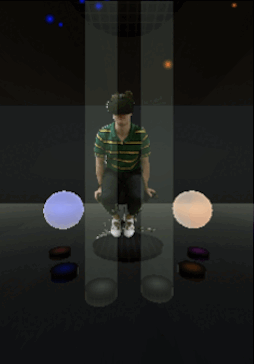
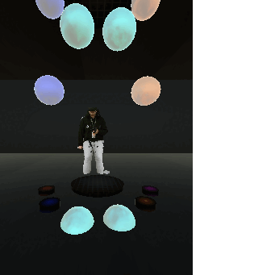

# ICSE26-VR-Testing

Based on the paper “Towards Automated Usability Testing of VR Applications Via Spatial and Temporal Aspects” 

This repository contains datasets, scripts, and models used for automated usability testing of VR applications.

# Scope 

The proposed solution is designed to predict the usability of virtual reality (VR) applications in several usability scenarios presented below.

Examples of static user interactions presenting several distinct issues, such as static noise, user avatar missplacement (below the floor or away from the camera), and errors in the user's avatar display.

Examples of dynamic user interactions showcasing a correct (left) and incorrect (right) usability scenario due to reachability and rendering problems:

Correct:   Issue: 

# Structure of the repository

## Executable files
-	Data_labeling.ipynb
	  -	Jupyter Notebook used for data labeling.
	  -	Generates interactive views of user-object interactions in 3D.

-	Model_Training_and_Evaluation.ipynb
	  -	Jupyter Notebook used for training machine learning models on the generated dataset.
	  -	Pre-processes the data and implements multiple model architectures.

## Reports

-	Dataset.xlsx
	  -	Contains the dataset summary.

-	 Model Results.xlsx
	  -	Summarizes model performance on spatial and temporal usability prediction.
	  -	Reports accuracy, precision, recall, and f1.

## Data

-	data
	  -	Contains the positional data used to train and evaluate the models.

## Extras

-	Data Labeling Guidelines – VR Testing.docx
	  -	Document outlining the labeling methodology for usability testing.
	  -	Includes examples and criteria used by human labelers.

# Requirements

## Dependencies

To be able to execute the code, ensure you have the following dependencies installed:

pip install numpy pandas scikit-learn tensorflow torch torchvision matplotlib

## Experimental environments 

For the original experiments, we used Google Colab Pro with the "High RAM" option enabled.

For data handling and access, we uploaded our files to Google Drive under MyDrive.

# Usage

## 1.	Data labeling
  Open Data_labeling.ipynb → Set the variables for the current configuration of the data in the "Index" cell →  Set up the correct paths to the data files in the "Read the data from spreadsheet" cell → Run all the cells up to the "Usage" cell → Input the desired range for the data labeling and run the "Usage" cell under "Spatial" and "Temporal" respectively.

Performing the above steps will generate interactive labeling views. These views display both the spatial and image data for each data point, along with label selection options (0 or 1) and an action button that saves the chosen label to the corresponding Google Sheet file.

## 2.	Model training and evaluation
  Open Model_Training_and_Evaluation.ipynb → Run all the subcells in the "PREREQS" cell → Identify the desired model(s) to train and evaluate from the following sections → Run the corresponding code cell

Performing the above steps will load and pre-process the data for model training. Running the code cell for the selected model will train and evaluate the model, then automatically save the model weights and evaluation metrics to Google Drive at the specified path.
